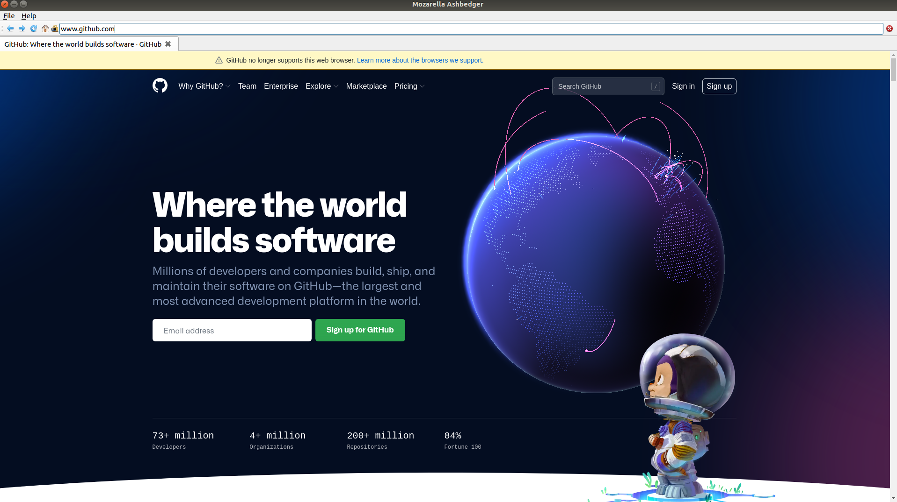

# Mozarella Webbrowser

This is my implementation of simple web browser, based on [Mozarella](https://github.com/pythonguis/15-minute-apps/tree/master/browser_tabbed)

## Features

It is simple browser. It allows to:
* add/close tabs
* reload page
* stop page loading
* go to homepage
* save/load html file

## Other licenses:

Icons used in the application are by [Yusuke Kamiyaman](http://p.yusukekamiyamane.com/).